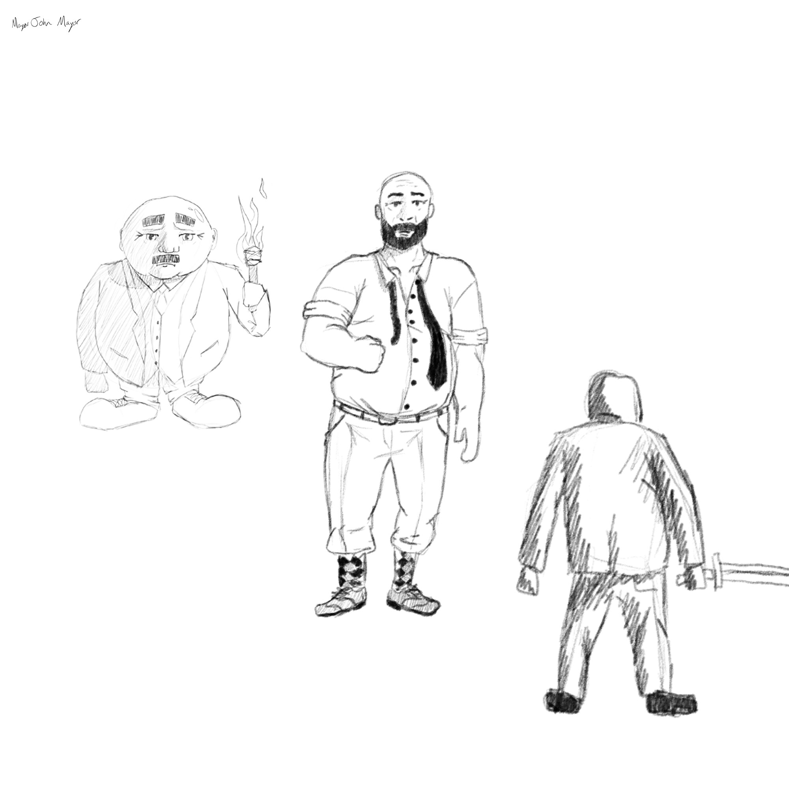
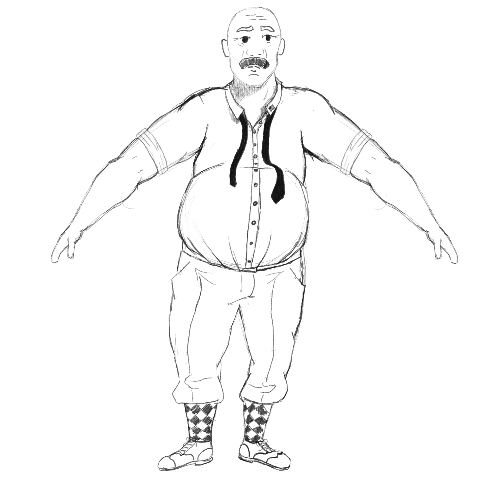
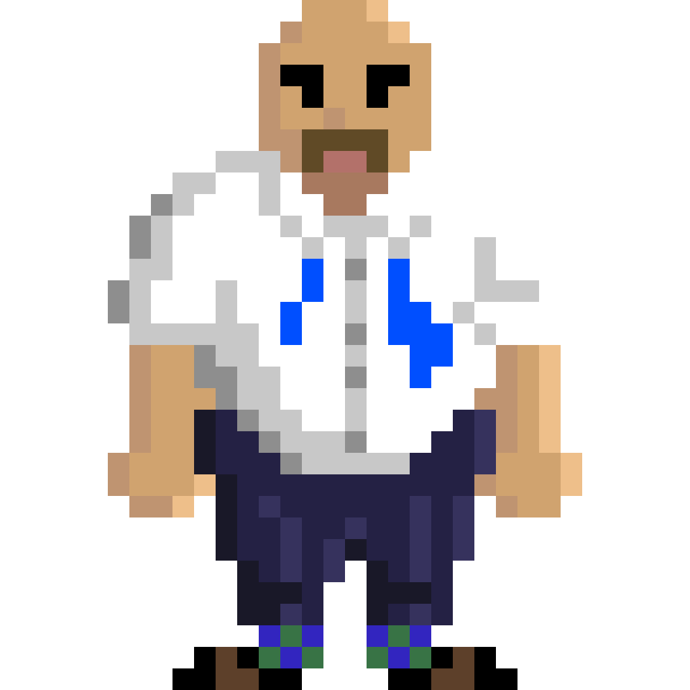
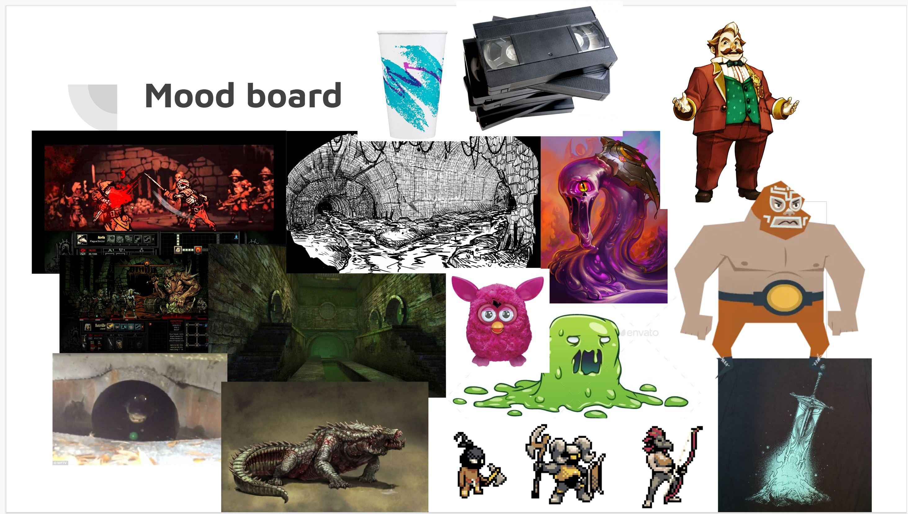
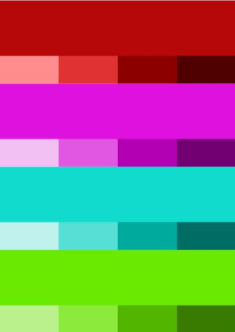
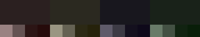
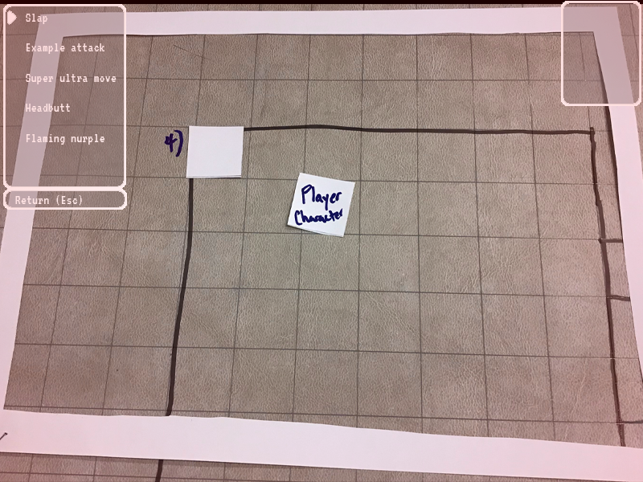

# Art and Interface

## Overview
This is the file containing concept art, interface mockups, and style information

## Concept Art

## Game Mode <A>

### Mockups

## Game Mode <B>

### Mockups
  We only have one game mode so far

### Screenshots & Demo Videos

## ...
